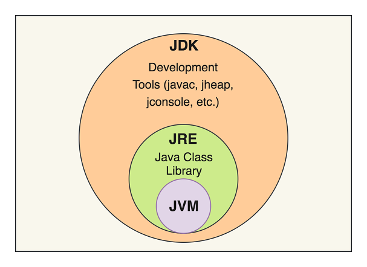

### JDK

*Java Development Kit* is the kit which provides the environment to develop and execute Java programs including:

  - Development Tools

  - JRE (to execute Java programs).

***

### JRE

*Java Runtime Environment* is an installation package which provides an environment to only run (not develop) the java program onto your machine. 

***

### JVM
*Java Virtual Machine* is the bytecode interpretor that runs the compiled Java code. 
